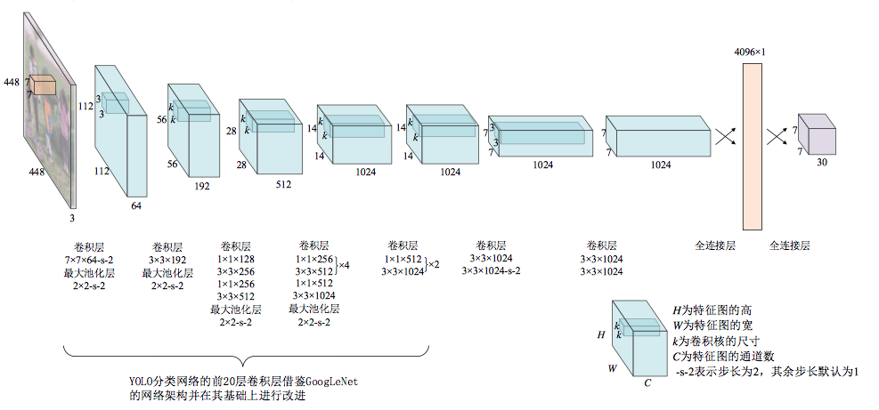

## Object Detection


[](https://github.com/bruce1408/Pytorch_learning)


&nbsp;This repository provides code for deep learning researchers to learn [Object Detection](https://machinelearningmastery.com/object-recognition-with-deep-learning/)
Object detection is the task of detecting instances of objects of a certain class within an image. The state-of-the-art methods can be categorized into two main types: one-stage methods and two stage-methods. One-stage methods prioritize inference speed, and example models include YOLO, SSD and RetinaNet. Two-stage methods prioritize detection accuracy, and example models include Faster R-CNN, Mask R-CNN and Cascade R-CNN.

This repository contains:

- **YOLO_v1**
- **YOLO_v2**
- **YOLO_v3**
- **YOLO_v4**
- **Instance Segmentation**

  - **FCN**

  - **U-Net**

## Table of Contents

- [Install](#install)
- [Dataset](#Dataset)
- [Usage](#usage)
- [Related impacts](#Related-impacts)
- [Contributors](#Contributors)
- [Reference](#Reference)

## Install

This project uses [Pytorch](https://pytorch.org/get-started/previous-versions/). Go check them out if you don't have them locally installed and thirt-party dependencies.

```sh
CUDA 10.1+
torch >= 1.5.0
$ pip install torch==1.5.0+cu101 torchvision==0.6.0+cu101 -f https://download.pytorch.org/whl/torch_stable.html
```

## Dataset

All data for this project can be found as follow
voc 2007 + voc 2012 dataset you can directly follow the link below to download, and put the pretrained model *yolo4_voc_weights.pth*, *yolo4_weights.pth* into the *yolo_v4/model_data* folder


- data <https://pan.baidu.com/s/1waymHzEgMXi6Mk5fiixUZw>  pasd: 7cbp

```sh
copy all data into data directory
```

## Usage
### 1.[YOLO_v1](https://arxiv.org/abs/1506.02640)

Traditional convolutional neural networks need to go through two steps of preselection and classification. This method will bring about a decrease in detection speed. YOLO innovatively proposes to use regression algorithm to directly obtain location information and classification without using pre-selected boxes. The generation link reduces the amount of calculation, thereby improving the training and detection speed of the network.

YOLO creatively transforms the object detection problem into a regression problem. The main idea is to divide an input picture into S×S grids. When the center of an object falls on a certain grid, this grid is responsible for detecting this object. It realizes the extraction of features in a single network and predicts the position coordinates of the bounding box and the probability of the target category.



YOLO_v1 use a network similar to GoogleNet as the backbone, the input image is ```448*448``` and the output is grid cells ```s*s```, the loss function of YOLO includes coordinate loss coordError, confidence loss IOUError and category prediction loss classError three parts.

### 2.YOLO_v1
### 3.YOLO_v1
### 4.YOLO_v1

## Reference


- [abeardear](https://github.com/abeardear)
- [Hoseong Lee](https://github.com/hoya012/deep_learning_object_detection)


## Contributors

This project exists thanks to all the people who contribute.
Everyone is welcome to submit code.

## VOC 数据集
voc 数据集的框是 xmin,ymin, xmax, ymax的格式,表示的是框的坐标

yolo 数据集表示的是框的 中心坐标位置,(归一化之后的),框的宽和高(归一化之后的)

计算方式:
((xmax + xmin)/2)/w, ((ymin + ymax)/2)/h, (xmax - xmin)/w, (ymax - ymin)/h

参考文献:
https://blog.csdn.net/weixin_41010198/article/details/106072347