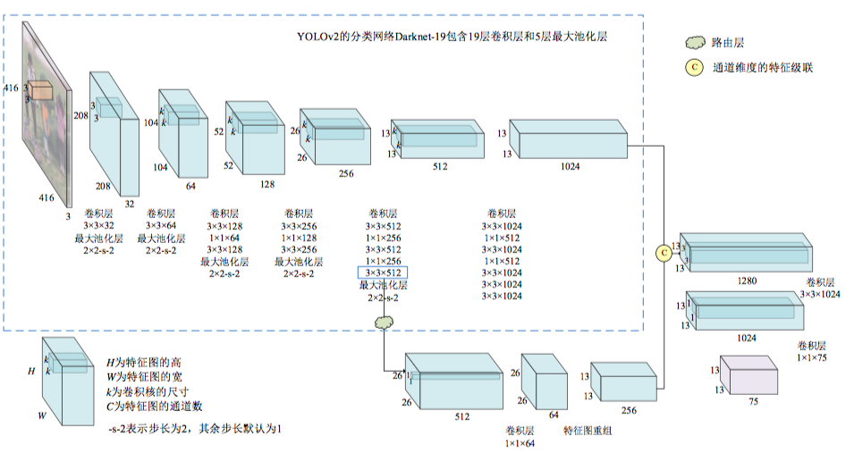
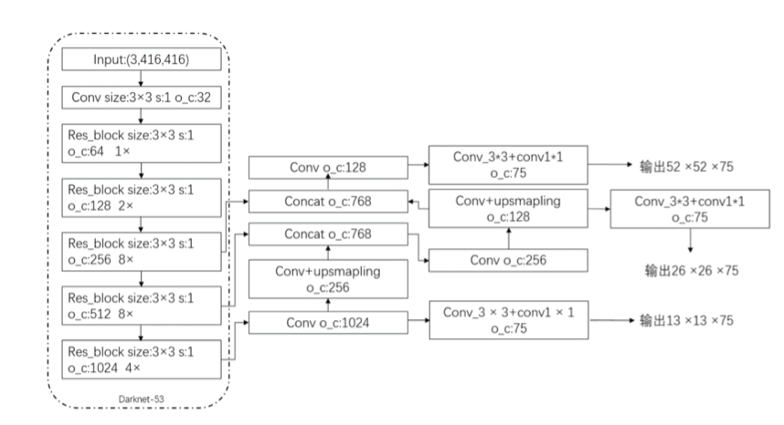
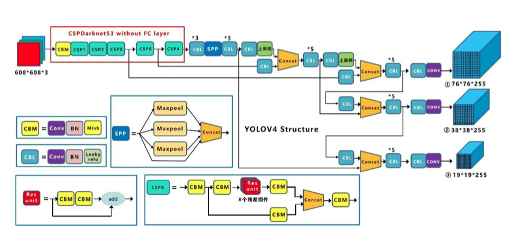

## Object Detection

[](https://github.com/bruce1408/Pytorch_learning)


&nbsp;This repository provides code for deep learning researchers to learn [Object Detection](https://machinelearningmastery.com/object-recognition-with-deep-learning/)
Object detection is the task of detecting instances of objects of a certain class within an image. The state-of-the-art methods can be categorized into two main types: one-stage methods and two stage-methods. One-stage methods prioritize inference speed, and example models include YOLO, SSD and RetinaNet. Two-stage methods prioritize detection accuracy, and example models include Faster R-CNN, Mask R-CNN and Cascade R-CNN.

This repository contains:

- **YOLO_v1**
- **YOLO_v2**
- **YOLO_v3**
- **YOLO_v4**
- **Instance Segmentation**

  - **FCN**

  - **U-Net**

## Table of Contents

- [Install](#install)
- [Dataset](#Dataset)
- [Usage](#usage)
- [Reference](#Reference)
- [Contributors](#Contributors)

## Install

This project uses [Pytorch](https://pytorch.org/get-started/previous-versions/). Go check them out if you don't have them locally installed and thirt-party dependencies.

```sh
CUDA 10.1+
torch >= 1.5.0
$ pip install torch==1.5.0+cu101 torchvision==0.6.0+cu101 -f https://download.pytorch.org/whl/torch_stable.html
```

## Dataset

All data for this project can be found as follow
voc 2007 + voc 2012 dataset you can directly follow the link below to download, and put the pretrained model _yolo4_voc_weights.pth_, _yolo4_weights.pth_ into the _yolo_v4/model_data_ folder

- data <https://pan.baidu.com/s/1waymHzEgMXi6Mk5fiixUZw> pasd: 7cbp

```sh
copy all data into data directory
```

## Usage

### [1.YOLO_v1](https://arxiv.org/abs/1506.02640)

Traditional convolutional neural networks need to go through two steps of preselection and classification. This method will bring about a decrease in detection speed. YOLO innovatively proposes to use regression algorithm to directly obtain location information and classification without using pre-selected boxes. The generation link reduces the amount of calculation, thereby improving the training and detection speed of the network.

YOLO creatively transforms the object detection problem into a regression problem. The main idea is to divide an input picture into S×S grids. When the center of an object falls on a certain grid, this grid is responsible for detecting this object. It realizes the extraction of features in a single network and predicts the position coordinates of the bounding box and the probability of the target category.


YOLO_v1 use a network similar to GoogleNet as the backbone, the input image is `448*448` and the output is grid cells `s*s`, the loss function of YOLO includes coordinate loss coordError, confidence loss IOUError and category prediction loss classError three parts.

### [2.YOLO_v2](https://arxiv.org/abs/1612.08242)

YOLOv2 introduces the BN operation to replace the dropout layer in YOLOv1 to prevent overfitting, start training with low resolution and fine-tune the classification network every 10 epochs of training, the model is gradully adjusted to high-resolution input. Moreover, the network structure also refers to the idea of Faster R-CNN, introduces the anchor box mechanism, and uses the K-means clustering method to select a priori frames of different widths and heights. By measuring the detection accuracy and speed, finally selects 5 anchor frames.YOLOv2 use Darknet-19 as the backbone.


YOLOv2 improves the detection ability of small objects through the fusion of high and low dimensional features. At the same time, the strategy of using small-size convolution kernels and pre-selected boxes reduces the amount of calculation of the network.

### [3.YOLO_v3](https://arxiv.org/abs/1804.02767)

The backbone network of YOLOv3 is inspired by ResNet, and uses Darknet-53, which is deeper and more robust, as the feature extraction network. Darknet-53 makes extensive use of shortcut connections in ResNet. In order to reduce the negative effect of the gradient caused by pooling, directly discards the pooling operation and uses the step size in the convolutional layer to achieve downsampling. The detection network of YOLOv3 introduces the concept of multi-scale prediction, that is, the number of detection layers is increased from the original 1 to 3, and the 3 layers correspond to three different scale feature maps of 13×13, 26×26 and 52×52. The author still uses K-means clusters out the size of the anchor boxes, and increases the number of anchor frames from 5 to 9, and divides them into three detection levels according to the size of the anchor frame. The YOLOv3 multi-scale detection strategy makes the current detection layer very good. Integrating contextual feature information, it is convenient for the model to predict targets of different scales.


YOLOv3 addresses some of the problems of YOLOv2, such as the detection of small objects that are easy to lose targets, and absorbs some of the better detection ideas today, such as the addition of residual modules, and channel splicing of deep and shallow features, and proposes a new network Darknet-53.

YOLOv3 performs feature fusion in three dimensions of low, medium, and high, and then performs convolution and regression respectively, and finally outputs feature maps of three scales. The final feature map sizes are `52×52×75`, `26×26×75`, and `13×13×75`, respectively. The generated feature map can correspond to the original image. Different feature map sizes represent the same division method. The feature map with a size of 52×52 is responsible for detecting small objects, and the feature map with a size of 26×26 is responsible for detecting medium-sized objects. 13×13 feature map is responsible for detecting large objects

### [4.YOLO_v4](https://arxiv.org/abs/2004.10934)

YOLOv4 is proposed by AlexeyAB and others on the basis of YOLOv3. The original intention of YOLOv4 is to accelerate the running speed of the model and optimize the neural network in parallel computing, so that the model can be trained and tested on conventional GPUs. YOLOv4 uses CSPDarknet53 as the feature extraction backbone network, and introduces SPP and PAN into the backbone network to achieve cross-layer fusion of features. YOLOv4 cleverly combines a variety of optimization techniques, its AP on the MS COCO data set reached 43.5%, and the detection speed on Tesla V100 reached 65FPS. YOLOv4 has reached a high level of accuracy and speed, and is one of the best detection algorithms in the current target detection algorithm.


In the feature pyramid structure, YOLOv4 uses the SPP structure and the PANet structure. The SPP structure is to maximize the pooling of the result of the feature layer P5 after three convolutions. In the pooling process, a total of four different scale pooling layers are used for processing, and the pooling core sizes are 1×1, 5×5, 9×9, and 13×13, respectively. After SPP processing, the receptive field can be effectively increased, and significant context characteristics can be separated. The PANet structure is a circular pyramid structure composed of convolution operations, up-sampling operations, feature layer fusion, and down-sampling operations. After the PANet structure, the different feature layers are fully integrated, which can effectively improve the feature extraction ability of defects. Finally, YOLOv4 Head uses the three feature layers processed by PANet to predict the results. Similar to the principle of YOLOv3 Head, it performs two convolution operations with sizes of 3×3 and 1×1. The check box is judged, whether it contains the target and the target type, and performs non-maximum suppression processing and a priori box adjustment to obtain the final prediction box.

### [Metrics](https://github.com/rafaelpadilla/Object-Detection-Metrics)

In the topics below there are some comments on the most popular metrics used for object detection.

## Reference

- [abeardear](https://github.com/abeardear)
- [Hoseong Lee](https://github.com/hoya012/deep_learning_object_detection)

- [longcw](https://github.com/longcw/yolo2-pytorch)

- [leetenki](https://github.com/leetenki/YOLOv2)

- [sgrvinod](https://github.com/sgrvinod/a-PyTorch-Tutorial-to-Object-Detection)

- [hoya012](https://github.com/hoya012/deep_learning_object_detection)

- [FelixFu520](https://github.com/FelixFu520/yolov1)

- [tztz](https://github.com/tztztztztz/yolov2.pytorch.git)

## Contributors

This project exists thanks to all the people who contribute.
Everyone is welcome to submit code.
